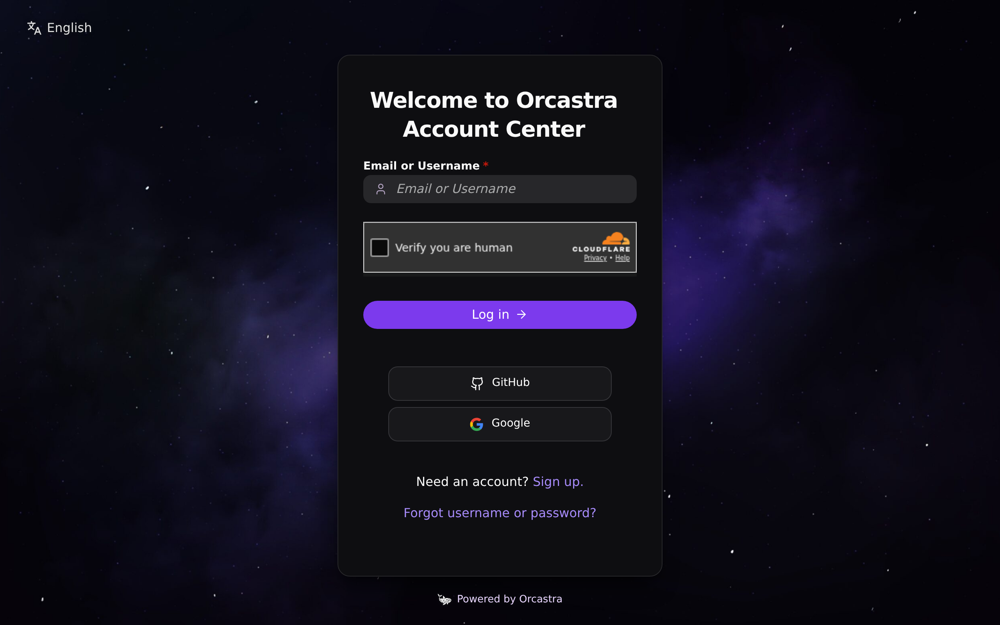

# Orcastra Authentik Theme Pack

Paket tema siap-publikasi untuk merakit **https://sso.orcastra.io** dari
Authentik 2026.2.x stok, di belakang nginx reverse proxy.

Tidak ada rahasia di repositori ini: tidak ada `.env`, token, client
secret OAuth, kunci rahasia Turnstile, atau kata sandi SMTP.

## Preview

Login produksi di [sso.orcastra.io](https://sso.orcastra.io):



Footer `Powered by Orcastra` + logo orca kecil, di tengah:


Screenshot lain (crop kartu, register, versi lama) tetap di `docs/images/`.

## Coba di komputer kamu

Mau meniru login Orcastra Account Center di laptop, tanpa domain,
Cloudflare, atau kartu kredit? Repo ini sudah punya `docker-compose.yml`
+ `env.example`. Clone, isi secret, `docker compose up` — nginx di depan
Authentik menyuntik theme JS dan menyajikan `/branding/` (tidak perlu
`apply-orcastra-theme.sh`).

```bash
git clone https://github.com/sctsivali/orcastra-authentik-theme.git
cd orcastra-authentik-theme
cp env.example .env
echo "PG_PASS=$(openssl rand -base64 36 | tr -d '\n')" >> .env
echo "AUTHENTIK_SECRET_KEY=$(openssl rand -base64 60 | tr -d '\n')" >> .env
docker compose pull && docker compose up -d
```

Lalu buka http://localhost:9000/if/flow/initial-setup/ untuk admin
pertama, dan tempel Brand lewat UI. Panduan lengkap (Bahasa Indonesia,
langkah demi langkah): [docs/00-docker-lokal.md](docs/00-docker-lokal.md).

## Isi paket

| Path | Isi |
| --- | --- |
| `docker-compose.yml` | Stack laptop: Postgres 16 + Authentik 2026.2.1 + worker + nginx |
| `env.example` | Template `.env` (secret kosong). Salin: `cp env.example .env` |
| `nginx/docker-default.conf` | Conf nginx laptop (THEME_VERSION=73, siap bind-mount) |
| `docs/00-docker-lokal.md` | Panduan nubi: clone → compose → Brand UI |
| `assets/brand.css` | CSS produksi terbaru (juga disalin ke `assets/branding/brand.css`) |
| `assets/branding/` | JS tema, logo, favicon, background, Lottie, CSS lama (referensi) |
| `nginx/nginx-branding.conf` | Drop-in nginx produksi: `/branding/` + suntik theme JS (`THEME_VERSION`) |
| `scripts/gen-env.sh` | Buat `.env` dari `env.example` + openssl (tidak menimpa) |
| `scripts/apply-orcastra-theme.sh` | Pasang aset + nginx, idempotent |
| `scripts/apply-brand-settings.md` | Set Brand/Tenant lewat UI atau `ak` shell |
| `assets/email/` | Template reset password light-mode (Inter, tanpa secret) |
| `docs/` | Panduan rebuild end-to-end (Bahasa Indonesia) |
| `docs/images/` | Screenshot login + footer produksi |

## Ringkasan 15 menit

Asumsi: host sudah menjalankan Authentik `2026.2.1` + postgres 16 +
nginx 1.27, terpublikasi sebagai `https://sso.orcastra.io`.
Jika belum, mulai dari [docs/01-prerequisites.md](docs/01-prerequisites.md).

1. **Pasang aset & nginx** (di host reverse proxy atau ke kontainer nginx):

   ```bash
   ./scripts/apply-orcastra-theme.sh \
     --docker-nginx <nama-kontainer-nginx> \
     --theme-version 73
   ```

   Atau di host: `--dest /usr/share/nginx/html/branding --nginx-conf /etc/nginx/conf.d/default.conf`

2. **Brand Authentik** — ikuti [scripts/apply-brand-settings.md](scripts/apply-brand-settings.md):
   judul `Orcastra Account Center`, tempel `assets/brand.css` ke Custom CSS,
   logo/favicon/background ke `/branding/…`, footer `Powered by Orcastra` →
   https://orcastra.io.

3. **Google + GitHub OAuth** — [docs/03-google-oauth.md](docs/03-google-oauth.md),
   [docs/04-github-oauth.md](docs/04-github-oauth.md). Callback tipikal
   `/source/oauth/callback/<slug>/`; **salin URL callback dari sumber
   Authentik**, jangan mengarang.

4. **Turnstile** — [docs/05-turnstile.md](docs/05-turnstile.md). Site key
   di Captcha stage; secret **hanya** di Authentik.

5. **SMTP + recovery + Register** —
   [docs/06-email-smtp.md](docs/06-email-smtp.md),
   [docs/07-register-recovery.md](docs/07-register-recovery.md).

6. **Go-live** — [docs/08-checklist.md](docs/08-checklist.md).

## Fakta produksi (tanpa rahasia)

- Authentik `ghcr.io/goauthentik/server:2026.2.1` + `nginx:1.27-alpine` + `postgres:16`
- Origin publik `https://sso.orcastra.io` (Cloudflare → host `:9000`)
- Footer `https://orcastra.io`
- Cache-bust theme JS `v=73`
- `ak-brand-links` adalah **light DOM** di Authentik 2026.2 — CSS footer
  harus di tingkat dokumen, bukan hanya di shadow root

## Apa yang dilakukan theme JS

`orcastra-theme.js` (disuntik nginx sebelum `</head>`) menata:

- Footer `ak-brand-links` (light DOM) + logo orca 18px
- Shadow DOM: tabs, MFA cards, nav kapsul, library header
- Hook navigasi SPA (`hashchange` / `popstate` / `ak-refresh` / MutationObserver)
- Loader Lottie 70px; logo disembunyikan selama loading
- Tombol login pill, ikon Lucide, ikon Google/GitHub
- MFA: seleksi satu kartu, bukan select-all
- Sidebar mobile: chevron expand/collapse

Detail: [docs/02-branding.md](docs/02-branding.md).

## Dokumentasi

0. [Coba di komputer kamu (Docker lokal)](docs/00-docker-lokal.md)
1. [Prasyarat & topologi](docs/01-prerequisites.md)
2. [Branding & theme JS](docs/02-branding.md)
3. [Google OAuth](docs/03-google-oauth.md)
4. [GitHub OAuth](docs/04-github-oauth.md)
5. [Cloudflare Turnstile](docs/05-turnstile.md)
6. [Email / Mailgun SMTP](docs/06-email-smtp.md)
7. [Register & recovery](docs/07-register-recovery.md)
8. [Checklist go-live](docs/08-checklist.md)

## Lisensi

Skrip, dokumentasi, CSS, dan theme JS: **MIT**.
Logo, favicon, background, artwork Lottie, screenshot: **All Rights Reserved**
(aset merek Orcastra). `lottie_light.min.js` adalah Lottie Web (**MIT**).
Lihat [LICENSE](LICENSE).
