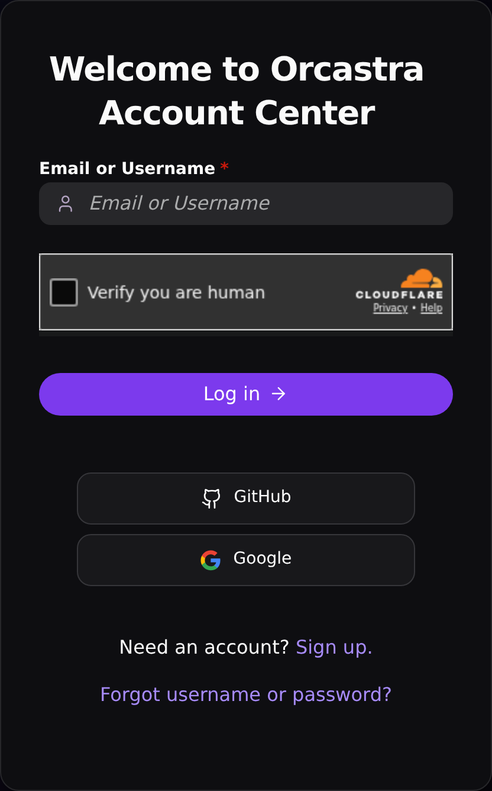
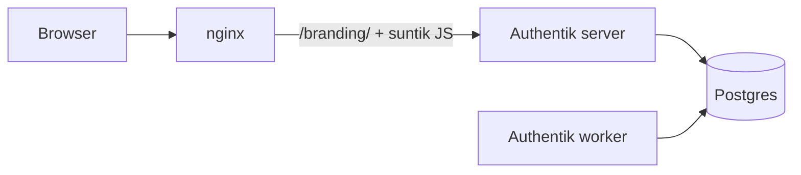

# 00 — Coba Orcastra Account Center di komputer kamu

Panduan ini untuk merakit **Orcastra Account Center** di laptop/PC pakai
Docker saja. Tidak perlu domain, Cloudflare, OAuth, Turnstile, atau
Mailgun. Targetnya: halaman login yang sama seperti produksi.


Referensi hidup: [https://sso.orcastra.io](https://sso.orcastra.io)

Kartu login di atas background nebula (crop lebih dekat):



## Yang kamu butuhkan

- Komputer (Windows, macOS, atau Linux)
- [Docker Desktop](https://docs.docker.com/desktop/) **atau** Docker Engine
  + plugin Compose v2
- Kira-kira 2 CPU / 2 GB RAM kosong (image Authentik cukup besar)
- `git`

Tidak perlu domain, tidak perlu Cloudflare, tidak perlu kartu kredit.

Cek Compose sudah ada:

```bash
docker compose version
```

Kalau perintah itu error, Docker belum siap — jangan lanjut dulu.

## Arsitektur (singkat)

Browser kamu tidak bicara langsung ke Authentik. Yang dipublikasikan ke
localhost **hanya nginx**. Nginx menyajikan file `/branding/` (logo,
background, theme JS) dan menyuntik `orcastra-theme.js` ke HTML sebelum
meneruskan request ke Authentik. Authentik sendiri hanya bicara ke
Postgres.



Kenapa nginx di depan? Tanpa itu, theme JS tidak masuk ke halaman dan
file logo/background 404. **Kalau kamu buka Authentik langsung** (port
kontainer 9000/9443, atau IP kontainer), yang muncul adalah Authentik
stok — bukan Orcastra. Compose di paket ini sengaja **tidak** mem-publish
port itu.

## Langkah 1 — Pasang Docker

- **Windows / macOS:** unduh [Docker Desktop](https://docs.docker.com/desktop/)
  dan pasang. Pastikan Docker Desktop sudah *running* (ikon paus di tray).
- **Linux:** pasang Docker Engine lalu plugin Compose v2. Ikuti
  [dokumentasi resmi](https://docs.docker.com/engine/install/).

Cek lagi:

```bash
docker compose version
```

## Langkah 2 — Clone repo

```bash
git clone https://github.com/sctsivali/orcastra-authentik-theme.git
cd orcastra-authentik-theme
```

Semua perintah berikutnya dijalankan **dari folder repo ini**. Kalau
kamu `compose up` dari folder lain, volume branding kosong dan logo
tidak muncul.

## Langkah 3 — Secret (`.env`)

Authentik butuh dua rahasia. Tidak ada yang di-commit ke git.

```bash
cp env.example .env
echo "PG_PASS=$(openssl rand -base64 36 | tr -d '\n')" >> .env
echo "AUTHENTIK_SECRET_KEY=$(openssl rand -base64 60 | tr -d '\n')" >> .env
```

Atau satu perintah: `./scripts/gen-env.sh` (menolak menimpa `.env` yang
sudah ada).

Artinya, singkat:

- **PG_PASS** — kata sandi database Postgres. Authentik memakai ini
  untuk nyambung ke DB. Harus di bawah 99 karakter (perintah di atas aman).
- **AUTHENTIK_SECRET_KEY** — kunci yang dipakai Authentik untuk
  menandatangani sesi/token. Beda dari password Postgres; jangan disalin
  sama.

Jangan commit `.env`. Jangan tempel isinya ke chat/issue.

`env.example` sudah mengisi `AUTHENTIK_TAG=2026.2.1` (cocok dengan theme
JS 2026.2.x). Nanti boleh kamu naikkan ke patch 2026.2.x yang lebih baru.

## Langkah 4 — Nyalakan stack

```bash
docker compose pull
docker compose up -d
docker compose ps
```

Yang sehat kira-kira begini: `postgresql` **healthy**, `server` /
`worker` / `nginx` **Up**. Kali pertama, `server` bisa beberapa menit
di status starting — itu migrasi database, wajar.

Kalau terasa macet:

```bash
docker compose logs -f server
```

Tunggu sampai log tidak lagi spam migrasi/boot, lalu coba browser.

## Langkah 5 — Admin pertama

Buka:

**http://localhost:9000/if/flow/initial-setup/**

Buat akun admin (email + password). Simpan sendiri; ini tidak ada di
repo.

Sesudah itu kamu masuk ke Authentik. Kunjungan pertama ke
http://localhost:9000 mungkin sudah menampilkan background angkasa kalau
Brand default kebetulan terisi — **judul, logo, dan CSS Orcastra masih
harus kamu tempel di langkah 6**.

## Langkah 6 — Pasang Brand Orcastra (lewat UI)

Ini yang mengubah "authentik" menjadi **Orcastra Account Center**. Tidak
ada skrip yang mengisi ini otomatis (sengaja: tidak menyentuh secret,
dan Authentik menyimpan Brand di database).

1. Masuk sebagai admin → **Admin interface**.
2. **System → Brands**.
3. Buka brand **default**. Untuk laptop, domain harus cocok dengan cara
   kamu membuka situs: isi `*` (wildcard) **atau** biarkan default/kosong
   yang berlaku untuk semua host. Yang penting **bukan**
   `sso.orcastra.io` kalau kamu mengakses lewat `localhost`. Kalau domain
   brand tidak match, CSS/logo tidak kepakai.
4. Isi **Branding settings** (nilai dari
   [scripts/apply-brand-settings.md](../scripts/apply-brand-settings.md)):
   - **Branding title:** `Orcastra Account Center`
   - **Logo:** `/branding/orca-logo.png`
   - **Favicon:** `/branding/favicon.ico`
   - **Default flow background:** `/branding/bg_orcastra-scaled-1.jpg`
   - **Custom CSS:** buka file `assets/brand.css` di editor (VS Code,
     Notepad, dsb.), **Select All**, copy, lalu tempel **seluruh isinya**
     ke kotak Custom CSS. Bukan URL — tempel teks CSS-nya.
5. **Save**.

Lalu footer:

1. **System → Settings**.
2. Cari **Footer links**. Tempel JSON ini:

```json
[
  {
    "name": "Powered by Orcastra",
    "href": "https://orcastra.io"
  }
]
```

3. **Save**.

## Langkah 7 — Cek login seperti produksi

Logout, atau buka **jendela privat/incognito**, lalu:

**http://localhost:9000**

Harusnya mirip screenshot di atas: background nebula, kartu login, pill
ungu, footer tengah **Powered by Orcastra** + logo orca kecil.


Teks hardcoded *Powered by authentik* disembunyikan CSS — kalau masih
kelihatan, Custom CSS belum kepaste atau brand domain tidak match.

**Tombol GitHub / Google tidak muncul di laptop baru.** Itu normal.
Tombol itu baru ada setelah kamu menambah sumber OAuth (langkah opsional).
Jangan kira setup gagal hanya karena dua tombol itu absen.

## Kesalahan umum

| Gejala | Penyebab yang sering |
| --- | --- |
| Login Authentik stok, tanpa logo/JS | Kamu membuka `:9443`, port 9000 kontainer `server`, atau IP kontainer — itu **melewati nginx**. Pakai `http://localhost:9000`. |
| CSS/judul tidak berubah | Domain brand bukan `*` / default, jadi tidak match `localhost`. |
| Kartu masih jelek, footer *authentik* | Lupa tempel **seluruh** `assets/brand.css` ke Custom CSS. |
| Theme JS versi lama | Cache browser. Hard refresh (Ctrl+Shift+R / Cmd+Shift+R). |
| `/branding/` 404, logo pecah | `docker compose` dijalankan dari folder yang salah, jadi bind-mount `assets/branding` kosong. `cd` ke repo, `down` lalu `up` lagi. |
| `Bind for 0.0.0.0:9000 failed` | Port 9000 sudah dipakai aplikasi lain. Ganti di `.env`: `COMPOSE_PORT_HTTP=19000` lalu `docker compose up -d` lagi, buka `http://localhost:19000`. |

## Berhenti / mulai lagi

```bash
docker compose down          # mati; data Postgres tetap (volume)
docker compose up -d         # nyala lagi, admin & brand masih ada
```

**Hati-hati:**

```bash
docker compose down -v       # HAPUS database. Admin, brand, CSS hilang.
```

Pakai `-v` hanya kalau kamu memang mau mulai dari nol.

## Lanjut (opsional)

Kalau login lokal sudah mirip screenshot, baru urus sisanya — boleh
skip semua ini sampai tampilan beres:

- Google / GitHub OAuth — [docs/03](03-google-oauth.md),
  [docs/04](04-github-oauth.md)
- Turnstile — [docs/05](05-turnstile.md)
- SMTP / register / recovery — [docs/06](06-email-smtp.md),
  [docs/07](07-register-recovery.md)

Rebuild produksi (domain, Cloudflare, nginx di host): mulai dari
[docs/01-prerequisites.md](01-prerequisites.md).
