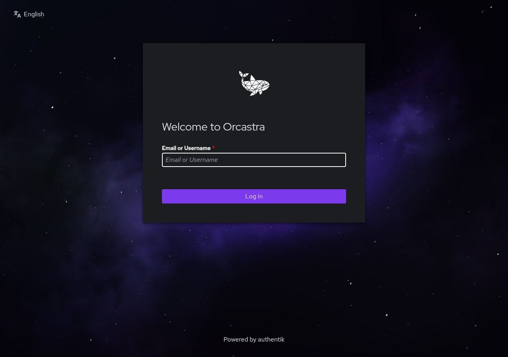
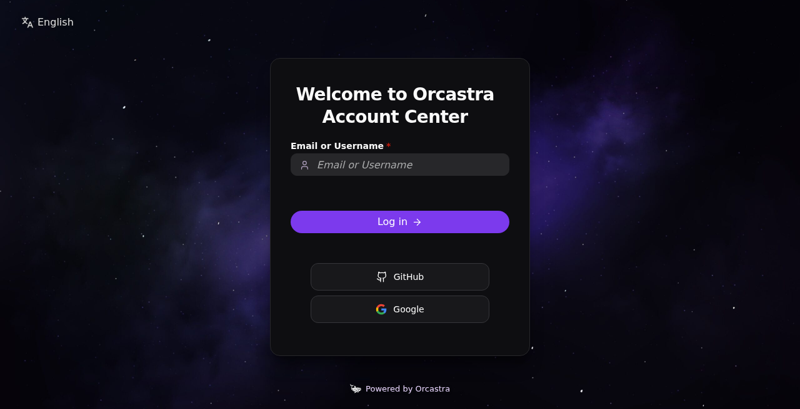

# 02 — Branding

Dua lapisan yang harus dipasang bersama:

1. **Aset + nginx** — `scripts/apply-orcastra-theme.sh`
2. **Brand/Tenant Authentik** — `scripts/apply-brand-settings.md`

Tanpa (1), `/branding/` 404 dan theme JS tidak pernah masuk ke HTML.
Tanpa (2), judul masih "authentik", background default, footer kosong.

## Pasang aset

Di host yang menjalankan nginx (atau ke kontainer nginx):

```bash
# Kontainer nginx (pola produksi)
./scripts/apply-orcastra-theme.sh --docker-nginx <nginx-container> --theme-version 73

# Host nginx
sudo ./scripts/apply-orcastra-theme.sh \
  --dest /usr/share/nginx/html/branding \
  --nginx-conf /etc/nginx/conf.d/default.conf \
  --theme-version 73
```

Skrip ini:

- Menyalin `assets/branding/*` ke direktori yang dilayani sebagai `/branding/`
- Menulis conf nginx yang:
  - melayani `/branding/` (JS tema: `Cache-Control: no-store`)
  - menyuntik `<script src="/branding/orcastra-theme.js?v=73" defer></script>`
    tepat sebelum `</head>` lewat `sub_filter`
  - menulis ulang sisa `?v=70`, `?v=71`, `?v=72` ke versi berjalan
- Idempotent; tidak membaca/menulis secret

Default **THEME_VERSION = 73** (cache-bust produksi). Naikkan angka itu
setiap kali `orcastra-theme.js` berubah.

## Set Brand Authentik

Ikuti [scripts/apply-brand-settings.md](../scripts/apply-brand-settings.md).
Ringkas:

- Title: `Orcastra Account Center`
- Logo `/branding/orca-logo.png`, favicon `/branding/favicon.ico`
- Background `/branding/bg_orcastra-scaled-1.jpg`
- Custom CSS: tempel `assets/brand.css`
- Footer tenant: `Powered by Orcastra` → https://orcastra.io
- Sembunyikan "Powered by authentik" lewat CSS `li:last-child` (bukan saklar UI)

UUID brand produksi `bc22ca39-66c2-422d-a4f2-017ac0107213` hanya contoh.

## Mengapa CSS harus di tingkat dokumen

Di Authentik **2026.2**, custom element `ak-brand-links` merender ke
**light DOM** (`createRenderRoot()` mengembalikan host). Aturan di dalam
shadow root flow executor **tidak** mengenai footer. `brand.css` (Custom
CSS brand) dan suntikan `orc-page-footer` di theme JS menempel di
`document`.

## Apa yang dilakukan `orcastra-theme.js`

File: `assets/branding/orcastra-theme.js`. Dimuat `defer`, guard
`window.__orcTheme`.

### Light DOM — `ak-brand-links`

- Footer login full-width, rata tengah
- Tautan ungu muda, ikon orca putih **18px** (`/branding/orca-logo-white.png`)
- Item terakhir (copy hardcoded Authentik) disembunyikan

### Shadow DOM — tabs, MFA, form

Menyuntik `<style>` ke `shadowRoot` komponen:

- `ak-tabs`: pill tabs, ikon Lucide per label, **chevron sidebar mobile**
  (`#orc-tab-toggle`) untuk expand/collapse nav vertikal ≤768px
- Tabel MFA / device: di mobile menjadi **kartu**. Seleksi diselaraskan ke
  `selectedMap` Authentik — **satu kartu**, bukan select-all native
- Form stacked penuh di mobile

### Hook navigasi SPA

Authentik adalah SPA. Theme tidak hanya jalan sekali:

- `hashchange`, `popstate`, `pageshow`
- event `ak-refresh`
- `MutationObserver` pada `document.documentElement`
- interval pendek saat boot + interval 2 detik

Setiap kali dipanggil, `inject()` menelusuri shadow root turunan.

### Loader Lottie 70px + sembunyikan logo

- Memuat `/branding/lottie_light.min.js` lalu
  `/branding/orcastra-loader.json`
- Spinner PatternFly utama (`#ak-placeholder`, `ak-loading-overlay`,
  empty-state) diganti kotak **70×70px** `.orc-lottie`
- Selama loading: atribut `data-orc-loading` di `<html>` dan
  `ak-flow-executor` — header/logo flow **disembunyikan** agar tidak
  dobel dengan animasi orca

Jangan ganti spinner di dalam tombol submit.

### Login pill, ikon sumber, Lucide

Pada `ak-stage-identification` / password / captcha / prompt:

- Tombol primer pill (`border-radius: 9999px`), ikon panah Lucide
- Tombol Google / GitHub: ikon brand, label teks
- Input identifier/password: ikon kiri (user / mail / lock)
- Slot Turnstile di-center

### User settings — capsule nav

Pada `ak-nav-buttons`: tombol header jadi kapsul bundar, Font Awesome
diganti ikon Lucide (bell, settings, logout, …), avatar cincin ungu.

### My applications — header ungu gelap

Pada `ak-library` / `ak-library-impl`: judul Geist, search pill, kartu
aplikasi gelap dengan hover ungu, header area gelap-ungu selaras dashboard
Orcastra.

## File aset

| URL | File |
| --- | --- |
| `/branding/orcastra-theme.js` | theme JS (no-store) |
| `/branding/brand.css` | salinan CSS produksi (referensi; yang aktif = Custom CSS brand) |
| `/branding/orcastra-prod.css` | CSS lama, jangan dipakai |
| `/branding/orca-logo.png` | logo default |
| `/branding/orca-logo-white.png` | logo footer |
| `/branding/orca-logo-black.png` | konteks terang |
| `/branding/favicon.ico` | favicon |
| `/branding/bg_orcastra-scaled-1.jpg` | background flow |
| `/branding/orcastra-loader.json` | animasi Lottie |
| `/branding/lottie_light.min.js` | runtime Lottie (MIT) |

## Screenshot referensi





Lanjut: [03-google-oauth.md](03-google-oauth.md).
